# 📒 Configure Stratis with the command line interface

> 💡 stratis는 물리적 스토리지 장치 풀을 관리하는 서비스로 실행됨.  
> 복잡한 스토리지 구성을 설정하고 관리하는 동시에 쉽게 로컬 스토리지 관리를 단순화함.  
>   
> [https://docs.redhat.com/ko/documentation/red_hat_enterprise_linux/8/html/managing_file_systems/setting-up-stratis-file-systems_managing-file-systems](https://docs.redhat.com/ko/documentation/red_hat_enterprise_linux/8/html/managing_file_systems/setting-up-stratis-file-systems_managing-file-systems)

In this challenge, we’ll install Stratis.

Stratis consists of two components.

First, the Stratis daemon, stratisd:

- manages collections of block devices
- provides a D-Bus API

Second, the Stratis command-line interface, stratis-cli:

- uses the D-Bus API to communicate with stratisd

To start off, install the stratisd and stratis-cli packages using a software package manager.

`sudo dnf -y install stratisd stratis-cli`

You can check the stratis-cli version.

`stratis --version`

Now, enable and start the stratisd systemd service using the systemctl utility.

`sudo systemctl --now enable stratisd`

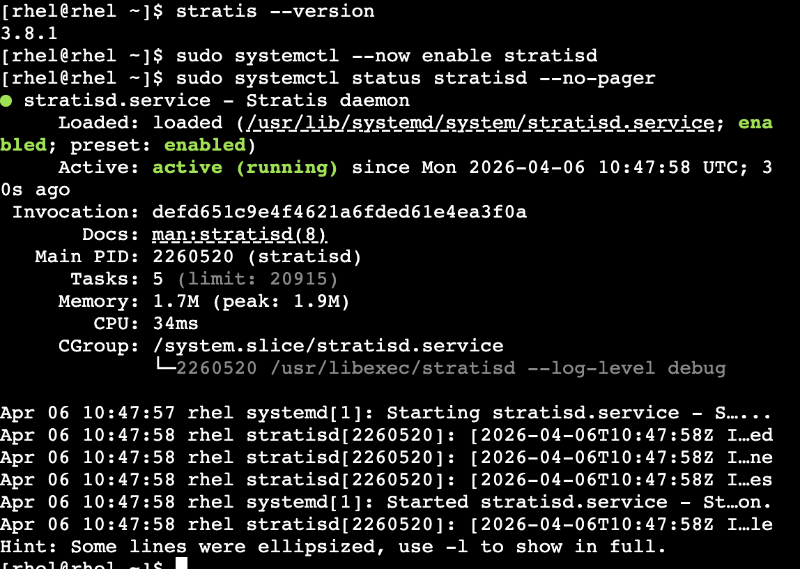

## List the pseudo block devices

This lab simulates block devices so we won’t be using actual drives. This limitation has no material effect on how Stratis would manage real block devices on a server or VM.

Use the command `lsblk`. The output will be similar to below.

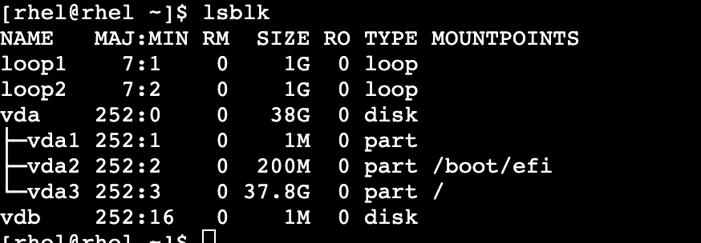

`loop1` , `loop2`  사용 가능.

## Create a storage pool

Now we’ll create a storage pool. This pool is created from one or more local disks or partitions, and file systems are created from the pool.

A pool has a fixed total size, equal to the size of the block devices.

The pool contains most Stratis layers, such as the non-volatile data cache using the dm-cache target.

Stratis creates a /dev/stratis/my-pool/ directory for each pool. This directory contains links to devices that represent Stratis file systems in the pool.

Create the pool `my_pool` from the block device `/dev/loop1` with the command below.

`sudo stratis pool create my_pool /dev/loop1`

List the pool you just created.

`stratis pool list`

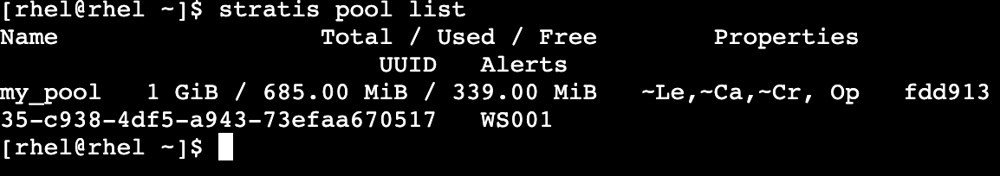

## Add another block device to the existing pool.

All pools contain a data tier, which contains one or more block devices used to store data. The block devices used to create the pool belong to the pool’s data tier.

You can add additional block devices to a pool as data devices, thereby increasing the disk space provided to the Stratis pool. This is helpful when you have exhaused the available space initially allocated to the pool.

The pool you created, `my_pool``, has 1 GiB of space. Add /dev/loop2 as a data device to my_pool.

`sudo stratis pool add-data my_pool /dev/loop2`

## List the block devices.

`stratis blockdev list`

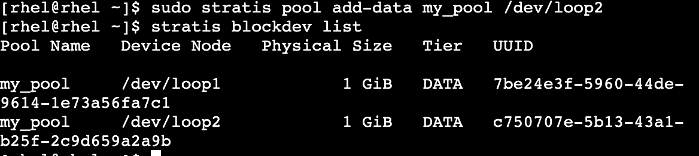

## Create a filesystem

A filesystem is a hierarchy of directories that is used to organize files on a storage media. Multiple Stratis filesystems may be created from a pool. Like pools, all filesystems must have a name; you can name the filesystem my_first_fs.

Create my_first_fs from the pool that you created, my_pool.

`sudo stratis filesystem create my_pool my_first_fs`

## List filesystems

At any point, you may list all existing Stratis filesystems.

`stratis filesystem list`

[!NOTE] There is a shortcut command `stratis fs` that performs the same operation.

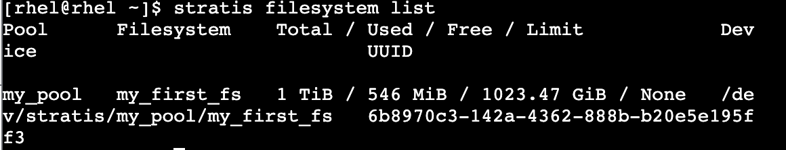

## Rename a filesystem

It is possible to rename a filesystem. This may be useful for a variety of reasons, such as updating the name of a test filesystem to a production ready name.

Rename `my_first_fs` to a new name, `my_fs`.

`sudo stratis filesystem rename my_pool my_first_fs my_fs`

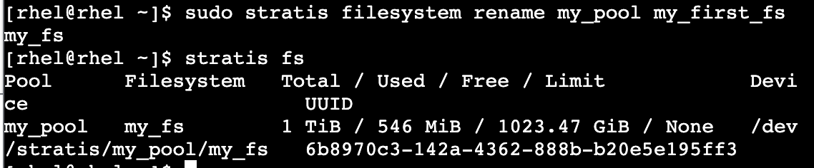

## Mount a filesystem

Mounting a filesystem means making the particular filesystem accessible at a certain point in the Linux directory tree. Your filesystem is unmounted, and cannot be used to store, read from, or write to files.

Choose a mount point, the directory in which the filesystem will be mounted. You will mount the filesystem, `my_fs`, in the directory `/mnt/test_mnt`.

`sudo mkdir /mnt/test_mnt`

Mount the filesystem using the `mount` command.

`sudo mount /dev/stratis/my_pool/my_fs /mnt/test_mnt`

The mount point, `/mnt/test_mnt`, will now be the root directory of the filesystem.

_Warning:_ If you do not choose an empty directory, the directory’s previous contents will become hidden until the filesystem is unmounted.

Confirm that the filesystem has been mounted by running the `mount` command.

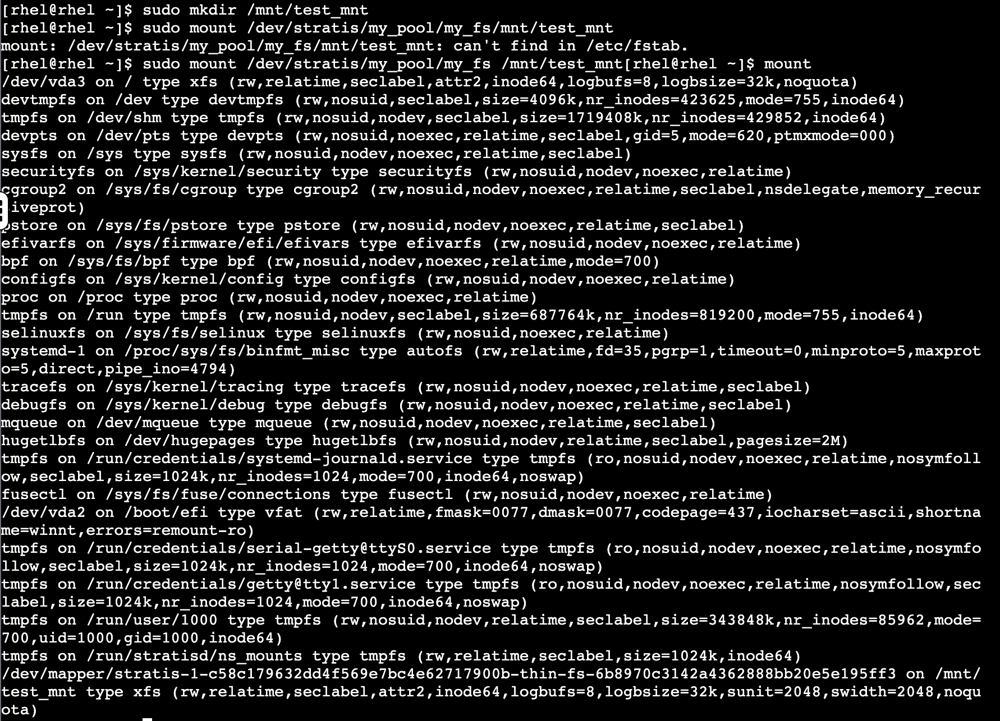

## Create files on mounted filesystem

Create two empty files in the filesystem, my_fs.

`sudo touch /mnt/test_mnt/my_first_file`

`sudo touch /mnt/test_mnt/my_second_file`

Check that the files have been created.

`ls /mnt/test_mnt`

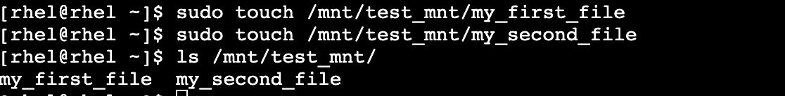

## Create a snapshot

A snapshot of a filesystem is a read/writeable thinly provisioned point in time copy of the source filesystem. To create a snapshot, you will need the name of the pool in which the filesystem is located, the name of the filesystem, and the name of the snapshot of the filesystem.

Create a snapshot of the filesystem. Name the snapshot `my_snapshot`.

`sudo stratis filesystem snapshot my_pool my_fs my_snapshot`

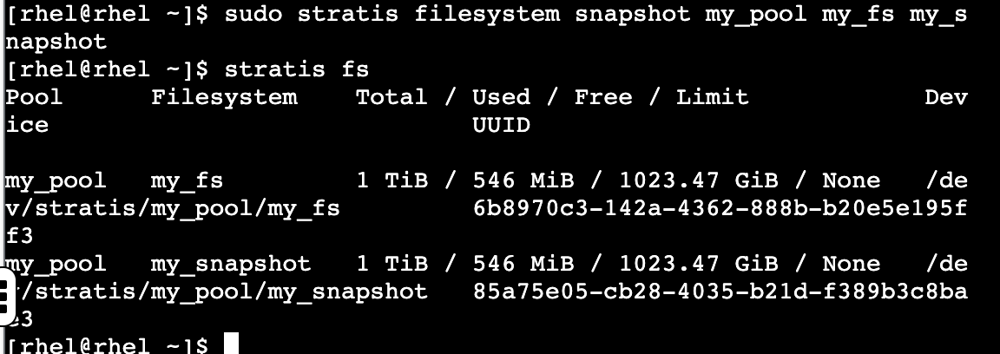

## Access the snapshot to recover files

Here is an example of how a snapshot can be used to recover deleted files from a filesystem.

Delete the first file that you created in the previous step.

`sudo rm -f /mnt/test_mnt/my_first_file`

Check that `my_first_file`` has been deleted.

`ls /mnt/test_mnt`

_Figure 2. rm first file_

You can see that `my_first_file` has been removed from the directory, and only `my_second_file` remains.

You can now mount the snapshot and get access to both files, since the snapshot was created before the file was deleted. First, create a new mountpoint to attach the snapshot into the filesystem, `/mnt/test_mnt_snap`.

`sudo mkdir /mnt/test_mnt_snap`

Next, mount the snapshot, `my_snapshot`.

`sudo mount /dev/stratis/my_pool/my_snapshot /mnt/test_mnt_snap`

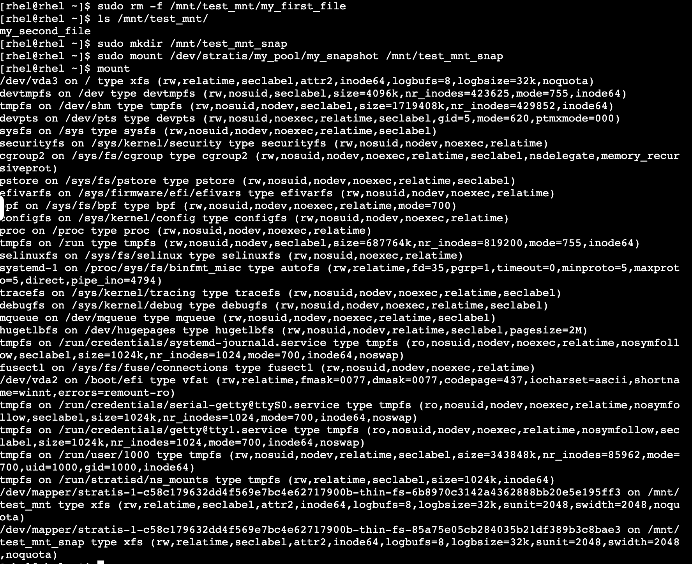

From the output above, the snapshot is mounted on `/mnt/test_mnt_snap`.

List the files stored within the snapshot on `/mnt/test_mnt_snap`.

`ls /mnt/test_mnt_snap`

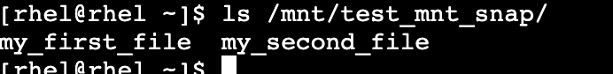

# Copy the file back to the original filesystem

Now that you have access to the previously deleted file, `my_first_file`, you may want to copy it back into the original filesystem, `my_fs`.

To do this, copy the file, `my_first_file` back into the original filesytem.

`sudo cp /mnt/test_mnt_snap/my_first_file /mnt/test_mnt`

Lastly, confirm that `my_first_file` has been copied to `/mnt/test_mnt`.

`ls /mnt/test_mnt`

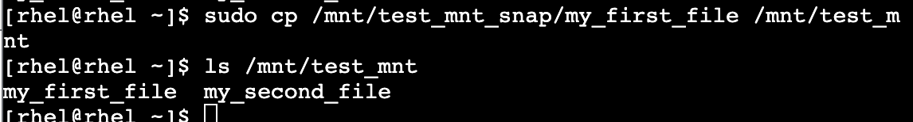

